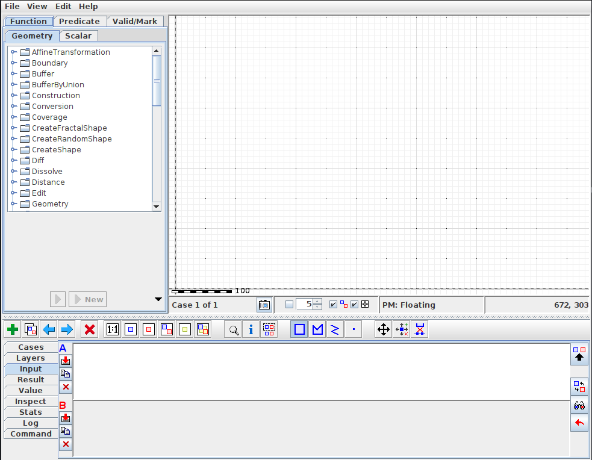

# Download and Build JTS TestBuilder

Download Maven and Java JDK (skip if already installed)

* On ubuntu 20.04

  ```
  sudo apt install maven

  sudo apt install openjdk-11-jdk
  ```

Clone project

```
git clone https://github.com/locationtech/jts.git

cd jts
```

Run project (2 options)

```
// Option 1
java -Dswing.defaultlaf=javax.swing.plaf.metal.MetalLookAndFeel -jar modules/app/target/JTSTestBuilder.jar -Xmx2000M

// Option 2
mvn clean install -DskipTests
./bin/testbuilder.sh &
```

App running


